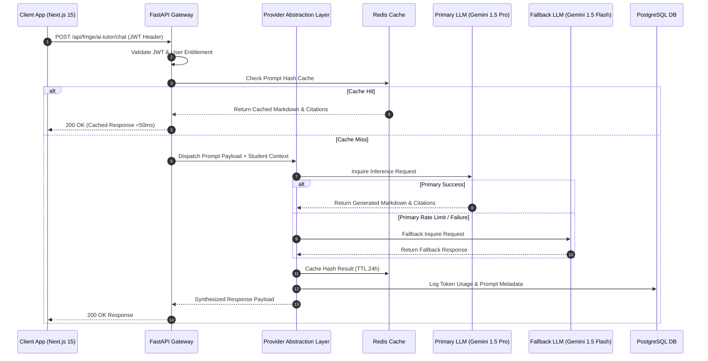
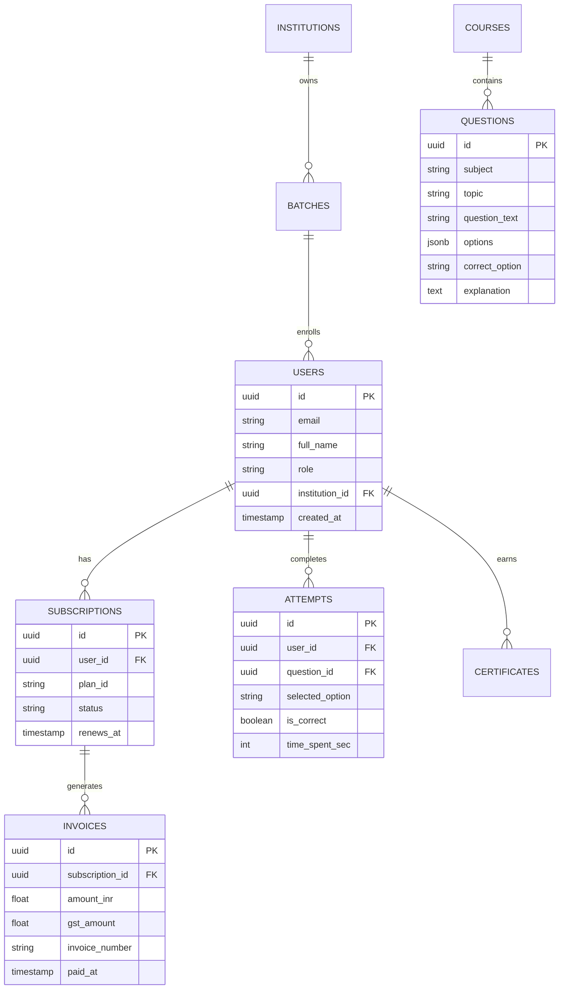

# Technical Design Document (TDD) — Healthcare AI Suite

**System Title**: Healthcare AI Suite Modular Monorepo  
**Products Included**: Aura Routes (AI Study Abroad), NursePass (AI Nursing Prep), FMGE AI (AI Medical Licensing Prep)  
**Document Status**: Production-Ready Architectural Baseline  
**Target Audience**: Principal Architects, Lead Software Engineers, DevOps Engineers, QA Engineers, Security Analysts  

---

## 1. Executive Summary

### 1.1 Purpose
The Healthcare AI Suite is an enterprise-grade multi-tenant AI Software-as-a-Service (SaaS) platform built as a modular monorepo. It houses three domain-specific vertical applications:
1. **Aura Routes**: AI-guided study abroad recommendation, university matching, and visa compliance platform.
2. **NursePass**: AI-powered nursing licensure exam preparation engine (NCLEX-RN, DHA, HAAD, Prometric).
3. **FMGE AI**: AI-powered foreign medical graduate licensing examination preparation, clinical case simulation, and educational PACS radiology/pathology interpretation workspace.

This Technical Design Document (TDD) defines the canonical technical specification, data models, infrastructure topologies, API boundaries, security controls, and engineering standards for the entire monorepo.

### 1.2 System Goals
- **Unified Infrastructure**: Provide a single shared core backend (`FastAPI`), database layer (`PostgreSQL`), background processing pipeline (`Celery + Redis`), and shared packages (`@healthcare-suite/*`) while ensuring physical or logical tenant isolation.
- **Sub-2 Second Performance**: Achieve sub-200ms API response latency for 95% of database requests and initial page paint under 1.5 seconds.
- **Enterprise Reliability**: Maintain 99.95% system uptime across multi-region deployment nodes on Railway.
- **Strict Compliance**: Adhere to OWASP Top 10 guidelines, WCAG 2.2 AA accessibility standards, 18% GST tax invoice regulations, and ISO/IEC 27001 data protection principles.

### 1.3 Target Users
- **B2C Medical & Nursing Aspirants**: Foreign medical graduates, nursing candidates, and study abroad applicants.
- **B2B Medical Colleges & Nursing Schools**: Administrators, Department Heads, and Professors managing student cohorts, batch enrollment codes, and assignments.
- **Platform Super Administrators**: Executive platform managers monitoring multi-tenant KPIs, AI token consumption, provider fallback, and security events.

### 1.4 Architectural Assumptions & Constraints
- **Assumptions**: Supabase Auth handles user authentication identity; Razorpay serves as the primary payment gateway for INR currency with 18% GST calculation; DeepMind Gemini and OpenAI handle LLM inferences via a unified provider abstraction layer.
- **Constraints**: Strict monorepo boundaries—no circular dependencies between shared packages; Next.js 15 App Router strict static prerendering constraints (`React.Suspense` boundaries for search parameters); single shared PostgreSQL instance with row-level tenant security (RLS).

---

## 2. System Architecture

### 2.1 High-Level Architecture (Mermaid)

```mermaid
graph TD
    Client[Web Browsers / Mobile Clients] --> CDN[Cloudflare CDN / Edge Router]
    
    subgraph Frontend Applications (apps/)
        CDN --> NextAura[apps/aura-routes - Next.js 15]
        CDN --> NextNurse[apps/nursepass - Next.js 15]
        CDN --> NextFMGE[apps/fmge-ai - Next.js 15]
    end

    subgraph Shared Monorepo Packages (packages/)
        NextAura & NextNurse & NextFMGE --> PkgUI[@healthcare-suite/ui]
        NextAura & NextNurse & NextFMGE --> PkgAuth[@healthcare-suite/auth]
        NextAura & NextNurse & NextFMGE --> PkgPayments[@healthcare-suite/payments]
        NextAura & NextNurse & NextFMGE --> PkgUtils[@healthcare-suite/utils]
    end

    subgraph Backend Core (backend/ - FastAPI)
        NextAura & NextNurse & NextFMGE --> APIGateway[FastAPI Core API Gateway]
        APIGateway --> AuraRouter[Aura API Routers]
        APIGateway --> NurseRouter[NursePass API Routers]
        APIGateway --> FMGERouter[FMGE AI Routers]
    end

    subgraph Infrastructure Services
        APIGateway --> SupabaseAuth[Supabase Auth Service]
        APIGateway --> Redis[Redis Cache & Message Broker]
        APIGateway --> Postgres[(PostgreSQL Database)]
        APIGateway --> CeleryWorkers[Celery Worker Cluster]
        APIGateway --> Razorpay[Razorpay Payment Gateway]
        APIGateway --> LLMLayer[AI Provider Abstraction - Gemini/OpenAI]
    end
```

### 2.2 Request Lifecycles & Flow Diagrams

#### 2.2.1 AI Request Lifecycle



---

## 3. Monorepo Architecture

### 3.1 Directory Topology

```
AURA/
├── apps/
│   ├── aura-routes/         # Next.js 15 Study Abroad Web App
│   ├── nursepass/           # Next.js 15 Nursing Licensing Web App
│   └── fmge-ai/             # Next.js 15 Medical Licensing Web App (56+ Routes)
├── backend/
│   ├── app/
│   │   ├── api/             # FastAPI Sub-routers (aura, nursepass, fmge, admin)
│   │   │   ├── fmge/        # FMGE Modules (M01-M15 APIs)
│   │   │   ├── nursepass.py # NursePass Routers
│   │   │   └── admin.py     # Super Admin APIs
│   │   ├── core/            # Configuration, Security, DB Connections
│   │   ├── models/          # SQLAlchemy Async ORM Entities
│   │   ├── services/        # Business Logic & AI Orchestrations
│   │   └── main.py          # FastAPI Entry Point & App Instantiation
│   ├── alembic/             # Database Migration Scripts
│   └── requirements.txt     # Python Dependencies
├── packages/
│   ├── auth/                # Supabase Auth Provider & RBAC Utilities
│   ├── payments/            # Razorpay Order Creation & Webhook Validators
│   ├── ui/                  # Shared React Components (ProductSwitcher, Modals)
│   ├── utils/               # Shared Typed Fetcher, cn() Tailwind Merger
│   ├── types/               # Shared TypeScript Contracts & Interfaces
│   └── ai/                  # Shared AI Prompt Utilities
├── infrastructure/          # Docker, Railway & Nginx Configurations
├── docs/                    # Architecture Decision Records (ADRs) & Specs
└── package.json             # Root NPM Workspace Manifest
```

### 3.2 Import & Ownership Rules
- **No Circular Imports**: `packages/*` MUST NOT import from `apps/*` or `backend/*`.
- **Shared UI Scope**: `packages/ui` only contains framework-agnostic React 19 components.
- **Product Isolation**: `apps/fmge-ai` cannot import private internal assets from `apps/nursepass`. All shared code MUST be elevated to `packages/`.

---

## 4. Backend Architecture (FastAPI & Python 3.13)

### 4.1 FastAPI Service Pattern
The backend adheres to a strict 4-tier layer pattern:
1. **Router Layer (`app/api/`)**: Defines HTTP verbs, paths, path parameters, dependency injection (`Depends`), and Pydantic schema validation.
2. **Service Layer (`app/services/`)**: Orchestrates business logic, domain algorithms, AI provider integrations, and payment calculations.
3. **Repository Layer (`app/repositories/`)**: Manages async database queries via SQLAlchemy `AsyncSession`.
4. **Model Layer (`app/models/`)**: Defines database table structures using SQLAlchemy Declarative Base.

### 4.2 Error Handling & Exception Strategy
Standardized HTTP error response format across all FastAPI routes:

```json
{
  "success": false,
  "error": {
    "code": "INSUFFICIENT_ENTITLEMENT",
    "message": "Clinical Case Simulator requires a Premium Pro or Ultimate subscription.",
    "details": {
      "required_plan": "premium",
      "current_plan": "free"
    }
  },
  "timestamp": 1785498000
}
```

---

## 5. Database Architecture (PostgreSQL Schema)

### 5.1 Relational Entity Overview



---

## 6. API Design Standards

### 6.1 RESTful Conventions & Pagination
All collection endpoints support standard pagination metadata:

```json
{
  "success": true,
  "data": [],
  "pagination": {
    "page": 1,
    "limit": 20,
    "total_items": 1450,
    "total_pages": 73,
    "has_next": true
  }
}
```

### 6.2 Canonical Endpoint Matrix (FMGE AI Module Suite)
- `POST /api/fmge/auth/signup`: Candidate registration & onboarding
- `GET /api/fmge/dashboard/overview`: Candidate dashboard metrics & readiness score
- `GET /api/fmge/qbank/questions`: 19-Subject MCQ retriever with adaptive difficulty
- `POST /api/fmge/mocks/submit`: NBE 300-Q CBT exam submission & score calculation
- `POST /api/fmge/clinical-cases/{id}/chat`: Conversational AI patient EMR dialogue
- `POST /api/fmge/ai-tutor/chat`: 24/7 AI Medical Tutor doubt solver
- `GET /api/fmge/images/catalog`: Educational PACS radiology/pathology image directory
- `POST /api/fmge/payments/create-order`: Razorpay order generation with 18% GST
- `GET /api/admin/fmge/overview`: Super Admin command center platform KPIs

---

## 7. Authentication & Authorization

### 7.1 Supabase Auth & JWT Validation
- **Identity Provider**: Supabase Authentication handles password hashing (Bcrypt), OAuth providers (Google), and refresh token rotations.
- **JWT Claims**: Requests contain custom claim metadata:
  ```json
  {
    "sub": "user_uuid_12345",
    "email": "rahul.sharma@example.com",
    "app_metadata": {
      "product": "FMGE_AI",
      "role": "STUDENT",
      "tenant_id": "inst-kursk-101"
    },
    "user_metadata": {
      "full_name": "Dr. Rahul Sharma"
    },
    "exp": 1785501600
  }
  ```

### 7.2 Role-Based Access Control (RBAC) Matrix

| Role | Access Level | Scope |
| :--- | :--- | :--- |
| `SUPER_ADMIN` | Full Operational Control | Multi-Tenant (Aura, NursePass, FMGE) |
| `INSTITUTION_ADMIN` | Institution Cohort Management | Single Institution |
| `FACULTY` | Class Assignments & Attendance | Assigned Batches |
| `STUDENT` | Learning Workspace & Exams | Personal Entitlement |

---

## 8. AI Architecture & Provider Abstraction

### 8.1 Unified Provider Abstraction Layer (`packages/ai`)

```python
class LLMProviderAbstraction:
    async def generate_response(self, prompt: str, system_context: str, model_preference: str = "gemini-1.5-pro") -> Dict[str, Any]:
        try:
            # Primary Route: DeepMind Gemini API
            return await self._call_gemini(prompt, system_context, model=model_preference)
        except (RateLimitException, APIConnectionException) as e:
            logger.warning(f"Primary LLM failed: {e}. Switching to OpenAI Fallback.")
            # Fallback Route: OpenAI GPT-4o-mini
            return await self._call_openai(prompt, system_context, model="gpt-4o-mini")
```

---

## 9. Shared Packages Specifications

### 9.1 Package Registry
1. `@healthcare-suite/ui`: Contains `ProductSwitcher`, `SidebarLayout`, `ImageZoomModal`.
2. `@healthcare-suite/auth`: Handles Supabase session state, client JWT decoding, and RBAC guards.
3. `@healthcare-suite/payments`: Formats Razorpay checkout options, handles INR currency conversion, and calculates 18% GST.
4. `@healthcare-suite/utils`: Provides typed fetcher wrapper and `cn()` Tailwind class merger.

---

## 10. Frontend Architecture (Next.js 15 App Router & React 19)

### 10.1 Static Prerendering & Suspense Rule
To comply with Next.js 15 prerendering constraints, any component accessing dynamic URL parameters (`useSearchParams()`, `usePathname()`) MUST be wrapped in a `<React.Suspense fallback={null}>` boundary within layout containers.

---

## 11. DevOps & Railway Deployment Strategy

### 11.1 Infrastructure Topology
- **Production Environment**: Deployed on Railway PaaS with auto-scaling container nodes.
- **Frontend Build Pipeline**: Turbopack-optimized `npx next build` producing standalone output bundles.
- **Database Migrations**: Automated Alembic migrations run prior to service container startup (`alembic upgrade head`).

---

## 12. Security Architecture

### 12.1 OWASP Mitigation Matrix
- **SQL Injection**: Prevented via SQLAlchemy Async parameterized ORM queries.
- **Cross-Site Scripting (XSS)**: Prevented via React automatic DOM escaping and strict Content Security Policy (CSP) headers.
- **Cross-Site Request Forgery (CSRF)**: Prevented via SameSite=Strict HTTP-only cookie headers and Supabase Bearer token verification.
- **Rate Limiting**: FastAPI Redis-backed rate limiter capping client requests to 100 req/min per IP.

---

## 13. Performance Architecture & SLA

### 13.1 Performance Metrics & Budgets
- **First Contentful Paint (FCP)**: < 1.2 seconds
- **Largest Contentful Paint (LCP)**: < 1.8 seconds
- **Cumulative Layout Shift (CLS)**: < 0.05
- **Backend API P95 Latency**: < 180 ms

---

## 14. Monitoring & Observability

- **Sentry**: Captures unhandled frontend and backend runtime exceptions with full stack traces.
- **PostHog**: Tracks user engagement events, funnel conversions, and feature flag analytics.

---

## 15. Notification Architecture

- **Multi-Channel Pipeline**: Dispatches alerts across In-App UI, Email (SendGrid), and WhatsApp (Twilio API).
- **Quiet Hours Enforcement**: Suppresses non-emergency reminders between 22:00 PM and 06:00 AM user local time.

---

## 16. Payment Architecture (Razorpay & GST)

- **GST Calculation Formula**:  
  $$\text{Final Payable Amount} = (\text{Base Price} - \text{Discount}) \times 1.18$$
- **Tax Invoice Compliance**: Generates PDF tax invoices containing HSN/SAC Code `998431` (Online Educational Services) and official GSTIN registration.

---

## 17. File Storage Architecture (Supabase Storage)

- **Bucket Hierarchy**:
  - `medical-images/`: Educational radiology DICOM & pathology high-res slides.
  - `certificates/`: Generated PDF certificates with public verification QR codes.
  - `invoices/`: GST Tax Invoice PDFs.

---

## 18. Testing Strategy & Coverage Goals

- **Unit Testing**: Pytest for backend services (Coverage Target: > 85%).
- **E2E Integration Testing**: Playwright for frontend user flows across Next.js applications.

---

## 19. Coding Standards & Git Conventions

- **Branch Naming**: `feat/feature-name`, `fix/bug-name`, `refactor/scope`.
- **Commit Messages**: Conventional Commit Specification (`feat(fmge-ai): ...`, `fix(backend): ...`).

---

## 20. Risk Assessment & Mitigation

| Technical / Operational Risk | Severity | Mitigation Strategy |
| :--- | :--- | :--- |
| Primary AI Provider Outage | HIGH | Automated Provider Fallback (Gemini -> OpenAI) in `packages/ai` |
| Database Connection Exhaustion | MEDIUM | Async SQLAlchemy connection pooling (`pool_size=20`, `max_overflow=10`) |
| Next.js Static Prerender Failures | MEDIUM | Mandatory `<React.Suspense>` wrappers around `useSearchParams()` |

---

## 21. Development Roadmap & Release Phases

- **Phase 1 (Completed)**: Core Framework & Shared Monorepo Packages (`packages/*`).
- **Phase 2 (Completed)**: FMGE AI Modules M01 – M06 (Landing, Auth, Dashboard, QBank, Mocks, Planner).
- **Phase 3 (Completed)**: FMGE AI Modules M07 – M10 (Clinical EMR, Voice Tutor, Image Lab, Analytics).
- **Phase 4 (Completed)**: FMGE AI Modules M11 – M15 (Certificates, Payments, Notifications, B2B LMS, Super Admin).

---

## 22. Appendix: Architecture Decision Records (ADRs)

### ADR-001: Choice of Modular Monorepo Architecture
- **Status**: APPROVED
- **Context**: The platform hosts three distinct healthcare verticals (Aura Routes, NursePass, FMGE AI).
- **Decision**: Adopt a modular monorepo structure. Shared UI components, payment wrappers, and authentication packages reside in `packages/`, while domain applications reside in `apps/` and API logic in `backend/`.
- **Consequences**: Maximizes code reuse and guarantees single-command deployment, while preventing microservice sprawl.

### ADR-002: Adoption of Supabase Auth for Unified Identity
- **Status**: APPROVED
- **Context**: Need a scalable, secure authentication provider with JWT and OAuth support.
- **Decision**: Standardize on Supabase Authentication across all monorepo applications.

### ADR-003: LLM Provider Abstraction & Fallback Engine
- **Status**: APPROVED
- **Context**: High availability is mandatory for 24/7 AI Tutor and Clinical Case Simulator features.
- **Decision**: Implement a fallback abstraction layer in `packages/ai` that routes primary requests to DeepMind Gemini 1.5 Pro and automatically failover to OpenAI GPT-4o-mini upon rate limit or service errors.
